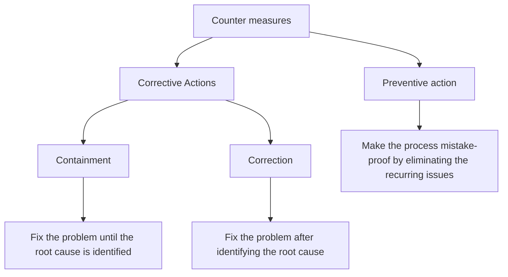

# 🧬 Charts-Plans-Variables-in-an-FMCG-case-study-using-Minitab-software
This repository represents additional control charts, various plans and variables that are used within the chart scope using Minitab software

---

## 🎀 Additional control charts
### CuSum charts
- A CuSum chart is a time weighted chart
- CuSum control chart incorportates all the information in a sequence of sample values by plotting the cumulative sums of the deviations of the sample values from the target value
- If μ₀ -> the target for the process mean
-    x̄ⱼ -> the average of the jᵗʰ sample

The cumulative sum control chart is formed by plotting the quantity as follows
-                Cᵢ = [j=1 to i] Σ (x̄-μ₀)
- The CuSum chart is ideal for detecting small shifts away from the target and good for monitoring process mean, defectives, defects and variances

### EWMA charts (Exponentially Weighted Moving Average Chart)
- It is time weighted control chart
- To plot data to detect small shifts over a small period of time
- To maintain process mean or variance
- Predict performance in next period of change or instability
- More weight on recent observations and less weight on the old observations
**Eg**: Used in Stock Modeling Software Packages

### EWMA Parameters
*λ-Weight*
- Weight is applied to the most recent rational subgroup average
- λ is between 0 and 1
- Usually λ is selected between 0.05 and 0.25

*L-Multiplier*
- Multiplier of rational subgroup standard deviation to set control limits
- Typically set to 3 to match other control charts
- Can be reduced for if λ is small (if 0.1≥λ, 2.6<L<2.8)

*Center-line*
This is represented by T or the target value of the quality characteristics 

*Control limits*
-          T ± L*S/√n * $\sqrt((λ/2-λ)*[1-(1-λ)^2i])$
T -> the estimates of the long-term process mean
S -> standard deviation established
n -> the no. of samples in the rational subgroup

The limits widen for each successive rational subgroup

*Plotted Stat*
-         Zᵢ = λx̄ᵢ+(1-λ)Zᵢ₋₁
x̄ᵢ -> current rational subgroup average
Zᵢ₋₁ -> running average of all preceding observations

---

## 🔦 Control plan
Control plan is a written summary description of the system for controlling a process
- It describes actions required to maintain the desired state of the process
- Describes actions required to minimize process and product variation
- Evolves and changes with the process
- Is considered a knowledge-transfer document
- Can be created for a process or a step or equipment in a process
- Provides a single point of reference
- Enables assignment of responsibility

---

## 💈 Strategy
- Minimizes process tampering
- States the reaction plan
- Signals when Kaizen activities are needed
- Describes training needs
- Describes maintenance schedule requirements
-         Good control plan should clearly describe:
-         1. What actions are to be taken?
-         2. When to take them?
-         3. Who should take them?
- This process a documented approach to be followed in the case of variation thereby reducing the "firefighting" syndrome in which systems stop performing and teams scrabble to fix them

## 🎎 Elements
A control plan is the major deliverable from the control phase:
- Project purpose and objectives
- Risk management
- Resource requirements and documents
- Process ownership certification
- Communication plan receommendation
- Process stewardship
- Financial analysis and results
- Response plan

### Response plan
The best management process may become unstable at some point. Along with the improvements, it is important to create a response plan to handle the process when things go beyond control

### Responsibility & Ownership
Describe responsibility and ownership  to take required actions whenever any unstable condition occurs

### Unstable conditions 
Define what unstable means for each vital X by performing FMEA

### Action plan
List the action steps to mitigate the unstable conditions

## 🦺 What to control - KPIV & KPOV
It is important to define what needs to be controlled to define a strong control plan
-        Process = f(x₁,x₂,....) = Y

|*Key performance i/p variables (KPIV)*|*Key performance o/p variable (KPOV)*|
|--------------------------------------|-------------------------------------|
|1. The x factors are called KPIV |1. The o/p Y is called KPOV|
|2. A control plan control the KPIV | 2. A control plan ensures the desired state for the KPOV |
|3. A control plan controls the i/p| 3. A control plan monitors the o/p|

### Identifying KPIVs:
- Failure Mode and Effect Analysis (FMEA)
- Cause-and-effect Matrix or Cause verification matrix
- Multi-vari studies
- Regression analysis
- Design of Experiments (DoE)

---
