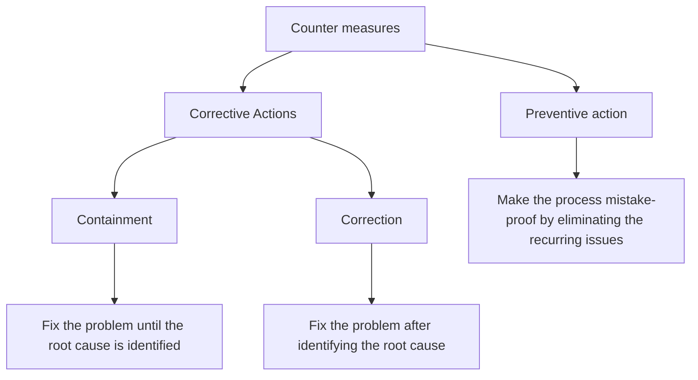
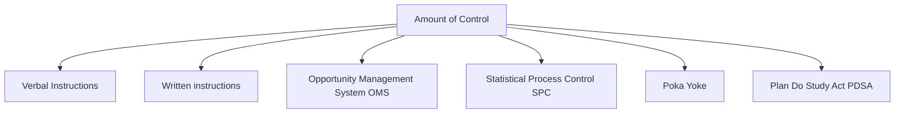
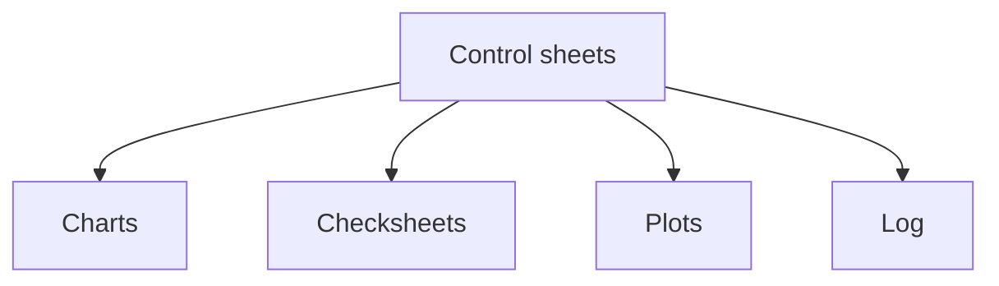

# 🧬 Charts-Plans-Variables-in-an-FMCG-case-study-using-Minitab-software
This repository represents additional control charts, various plans and variables that are used within the chart scope using Minitab software

---

## 🎀 Additional control charts
### CuSum charts
- A CuSum chart is a time weighted chart
- CuSum control chart incorportates all the information in a sequence of sample values by plotting the cumulative sums of the deviations of the sample values from the target value
- If μ₀ -> the target for the process mean
-    x̄ⱼ -> the average of the jᵗʰ sample

The cumulative sum control chart is formed by plotting the quantity as follows
-                Cᵢ = [j=1 to i] Σ (x̄-μ₀)
- The CuSum chart is ideal for detecting small shifts away from the target and good for monitoring process mean, defectives, defects and variances

### EWMA charts (Exponentially Weighted Moving Average Chart)
- It is time weighted control chart
- To plot data to detect small shifts over a small period of time
- To maintain process mean or variance
- Predict performance in next period of change or instability
- More weight on recent observations and less weight on the old observations
**Eg**: Used in Stock Modeling Software Packages

### EWMA Parameters
*λ-Weight*
- Weight is applied to the most recent rational subgroup average
- λ is between 0 and 1
- Usually λ is selected between 0.05 and 0.25

*L-Multiplier*
- Multiplier of rational subgroup standard deviation to set control limits
- Typically set to 3 to match other control charts
- Can be reduced for if λ is small (if 0.1≥λ, 2.6<L<2.8)

*Center-line (CL)*
This is represented by T or the target value of the quality characteristics 

*Control limits*
-          T ± L*S/√n * $\sqrt((λ/2-λ)*[1-(1-λ)^2i])$
T -> the estimates of the long-term process mean
S -> standard deviation established
n -> the no. of samples in the rational subgroup

The limits widen for each successive rational subgroup

*Plotted Stat*
-         Zᵢ = λx̄ᵢ+(1-λ)Zᵢ₋₁
x̄ᵢ -> current rational subgroup average
Zᵢ₋₁ -> running average of all preceding observations

---

## 🔦 Control plan
Control plan is a written summary description of the system for controlling a process
- It describes actions required to maintain the desired state of the process
- Describes actions required to minimize process and product variation
- Evolves and changes with the process
- Is considered a knowledge-transfer document
- Can be created for a process or a step or equipment in a process
- Provides a single point of reference
- Enables assignment of responsibility

---

## 💈 Strategy
- Minimizes process tampering
- States the reaction plan
- Signals when Kaizen activities are needed
- Describes training needs
- Describes maintenance schedule requirements
-         Good control plan should clearly describe:
-         1. What actions are to be taken?
-         2. When to take them?
-         3. Who should take them?
- This process a documented approach to be followed in the case of variation thereby reducing the "firefighting" syndrome in which systems stop performing and teams scrabble to fix them

## 🎎 Elements
A control plan is the major deliverable from the control phase:
- Project purpose and objectives
- Risk management
- Resource requirements and documents
- Process ownership certification
- Communication plan receommendation
- Process stewardship
- Financial analysis and results
- Response plan

### Response plan
The best management process may become unstable at some point. Along with the improvements, it is important to create a response plan to handle the process when things go beyond control

### Responsibility & Ownership
Describe responsibility and ownership  to take required actions whenever any unstable condition occurs

### Unstable conditions 
Define what unstable means for each vital X by performing FMEA

### Action plan
List the action steps to mitigate the unstable conditions

## 🦺 What to control - KPIV & KPOV
It is important to define what needs to be controlled to define a strong control plan
-        Process = f(x₁,x₂,....) = Y

|*Key performance i/p variables (KPIV)*|*Key performance o/p variable (KPOV)*|
|--------------------------------------|-------------------------------------|
|1. The x factors are called KPIV |1. The o/p Y is called KPOV|
|2. A control plan control the KPIV | 2. A control plan ensures the desired state for the KPOV |
|3. A control plan controls the i/p| 3. A control plan monitors the o/p|

### Identifying KPIVs:
- Failure Mode and Effect Analysis (FMEA)
- Cause-and-effect Matrix or Cause verification matrix
- Multi-vari studies
- Regression analysis
- Design of Experiments (DoE)

---

## 🦥 Tools to develop & execute control plan
*Control charts* -> Useful to track process statistics overtime and detect the presence of special causes
*Measurement System Analysis (MSA)* -> A technique that identifies measurement error (variation) and source of that error to reduce the variation
*Error-proofing* -> Also known as **Poka-Yoke**. It refers to the implementation of fail-safe mechanisms within a process to prevent it from creating defects
*SOP* -> It is also known as **Standard Operating Procedure**. It is a set of written instructions that details all the steps and activities of a process or procedure
*PM* -> It is also known as **Preventive Maintenance**. It refers to the inclusion of PM as a part of the documented scheduled process or equipment maintenance

### Using the tools
- It is important to understand the basics of creating a control plan before you define a control plan
- After understanding the process, a multi-functional team must be formed that will be responsible for controlling the process
-             Process Flow diagram
-             FMEA
-             Special Characteristics (Critical & Significant)
-             Control plans or lessons learned from similar parts/processes
-             Technical documentation
-             Validation plan results
-             Optimization methods
-             Team knowledge of the process

### Choosing a right level of control

Control plan helps in standardization of the various processes of the system
*Characteristic/Parameter*:
- The metric to be measured is determined through team discussions
- The discussions should involve key team members
- This parameter can be standardized across similar processes or equipments to measure the performance of the process

*Critical-To-Quality CTQ/CL*
- These parameters help in measuring the impact on process performance and have known to impact process performance negatively if not measured and controlled

*Specification/Requirement*
- Team discussions
- Understand the Technology
- The history of the process

*Measurement/Method*
- Availability of the equipment for the process
- Calibration and MSA needs of the equipment
- Training needs on the tool or the method
- Supporting Manufacturing Performance Index (MPI)
- Other operational blueprint requirements
- The tool used to capture the time of entry of each purchase order in server stamp in the access database. These stamps calculate the total time used for completely entering the purchase order in the system

*Sample size* -> All data entries in the acces database are used in the metric calculation
The person selected will be based on:
- Needs of the process
- Location of the person
- Processes or equipment
- Skills of the person

The purchase order administration will be measuring process

- Control methods should be customized for different floor or functional applications
- These methods use as much quantitative information as possible to provide objective information
- Paper charting may be preferrable as a starting point when compared to using a computer

*Decision rule/Corrective action*
- Include references to process support documentation such as corrective procedures, troubleshooting maps and so on
- The decision rule analyzes the reason for the length of time entry, followed by a corrective action, to control the length

*Reference number*
- Facilitate access to documented or corrected procedures against each corrective measure identified in the previous section

---

## 🧘🏼 Case study - Coil Surface Thickness Monitoring
### Process background:
- **Plant**: Precision Strips Special Product Division
- **Objective**: Maintain uniform coating thickness on steel coils (Target: 7.5 ± 0.3 μm)
- **Problem**: Frequent minor coating shifts going undetected using traditional control charts
- **Output measured**: Surface Coating Thickness
- **Input Variables (KPIV)**:
  - Roll Pressure (P)
  - Bath temperature (T)
  - Line Speed (S)
- **Output (KPOV)**: Final Coating Thickness

### Measurement System Analysis (MSA)
- Initially run a randomized run order matrix by creating Gage R&R matrix
- Accept the micrometer only if Total Gage R&R %Study Var <= 10% and ndc>5. Else, do not accept it

### CuSum Chart
- The first week shows both C⁺ and C⁻ within h - process in statistical control. A rising C⁺ crossing h on day 12 signals a +1σ mean shift; maintenance adjusts cutter speed

### EWMA chart
- Four consecutive points below LCL in week 3 indicate a prolonged downward drift; tool is replaced

### Linking KPIVs & KPOVs
|*KPIV (X)*|*Sensor/Range*|*Control Method*|*KPOV impact*|
|----------|--------------|----------------|-------------|
|Cutter speed (rpm)| CNC log 5000 ± 50 | CuSum on X records | High speed represents smaller diameter|
|Coolant temperature|RTD 18 ± 1| EWMA on hourly average | High temperature represents larger diameter |
|Tool-wear index|Vision system 0-1|P chart for wear > 0.8|High wear represents tapered hole|

---

## 🤲🏻 Requirements
- Minitab 2021 or above
- Control charts fundamentals

---
*"All improvement happens project by project and in no other way" - Joseph M Juran*

